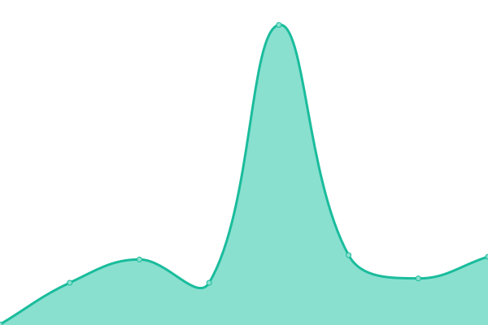

# [📈 Live Status](https://up.adplaytechnology.com): <!--live status--> **🟧 Partial outage**

This repository contains the open-source uptime monitor and status page for [Ijaz Ahmed](https://up.adplaytechnology.com), powered by [Upptime](https://github.com/upptime/upptime).

With [Upptime](https://upptime.js.org), you can get your own unlimited and free uptime monitor and status page, powered entirely by a GitHub repository. We use [Issues](https://github.com/ijazrushad/ijaz-upptime/issues) as incident reports, [Actions](https://github.com/ijazrushad/ijaz-upptime/actions) as uptime monitors, and [Pages](https://up.adplaytechnology.com) for the status page.

<!--start: status pages-->
<!-- This summary is generated by Upptime (https://github.com/upptime/upptime) -->
<!-- Do not edit this manually, your changes will be overwritten -->
<!-- prettier-ignore -->
| URL | Status | History | Response Time | Uptime |
| --- | ------ | ------- | ------------- | ------ |
|  [Quizmaster](https://quizmaster.shabox.mobi) | 🟩 Up | [quizmaster.yml](https://github.com/ijazrushad/ijaz-upptime/commits/HEAD/history/quizmaster.yml) | 

 1438ms
     
 | 

<a href="https://up.adplaytechnology.com/history/quizmaster">100.00%</a>
    

|  [Gamestar](https://gamestar.shabox.mobi) | 🟩 Up | [gamestar.yml](https://github.com/ijazrushad/ijaz-upptime/commits/HEAD/history/gamestar.yml) | 

 1237ms
     
 | 

<a href="https://up.adplaytechnology.com/history/gamestar">100.00%</a>
    

|  [Wordstar](https://wordstar.shabox.mobi) | 🟩 Up | [wordstar.yml](https://github.com/ijazrushad/ijaz-upptime/commits/HEAD/history/wordstar.yml) | 

 1034ms
     
 | 

<a href="https://up.adplaytechnology.com/history/wordstar">100.00%</a>
    

|  [AdPlay Website](https://adplaytechnology.com) | 🟥 Down | [ad-play-website.yml](https://github.com/ijazrushad/ijaz-upptime/commits/HEAD/history/ad-play-website.yml) | 

 416ms
     
 | 

<a href="https://up.adplaytechnology.com/history/ad-play-website">4.91%</a>
    

|  [VU Website](https://vumobile.biz) | 🟥 Down | [vu-website.yml](https://github.com/ijazrushad/ijaz-upptime/commits/HEAD/history/vu-website.yml) | 

 571ms
     
 | 

<a href="https://up.adplaytechnology.com/history/vu-website">8.54%</a>
    

|  [Baarta Website](https://baarta.co) | 🟥 Down | [baarta-website.yml](https://github.com/ijazrushad/ijaz-upptime/commits/HEAD/history/baarta-website.yml) | 

 565ms
     
 | 

<a href="https://up.adplaytechnology.com/history/baarta-website">7.14%</a>
    

|  [AdPlay RTB](https://rtb.adplay-mobile.com) | 🟩 Up | [ad-play-rtb.yml](https://github.com/ijazrushad/ijaz-upptime/commits/HEAD/history/ad-play-rtb.yml) | 

 1686ms
     
 | 

<a href="https://up.adplaytechnology.com/history/ad-play-rtb">99.82%</a>
    

|  [AdPlay Game](https://game.adplay-mobile.com) | 🟥 Down | [ad-play-game.yml](https://github.com/ijazrushad/ijaz-upptime/commits/HEAD/history/ad-play-game.yml) | 

 1433ms
     
 | 

<a href="https://up.adplaytechnology.com/history/ad-play-game">99.13%</a>
    

|  [AdPlay Games](https://games.adplay-mobile.com) | 🟩 Up | [ad-play-games.yml](https://github.com/ijazrushad/ijaz-upptime/commits/HEAD/history/ad-play-games.yml) | 

 572ms
     
 | 

<a href="https://up.adplaytechnology.com/history/ad-play-games">100.00%</a>
    

<!--end: status pages-->

[**Visit our status website →**](https://up.adplaytechnology.com)

## 📄 License

- Powered by: [Upptime](https://github.com/upptime/upptime)
- Code: [MIT](./LICENSE) © [Anand Chowdhary](https://anandchowdhary.com), supported by [Pabio](https://pabio.com)
- Data in the `./history` directory: [Open Database License](https://opendatacommons.org/licenses/odbl/1-0/)
